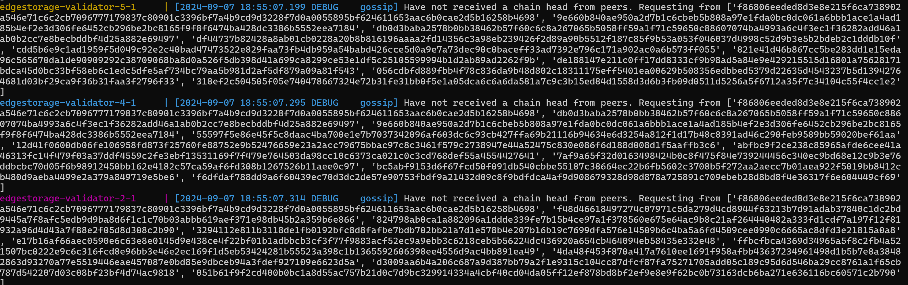
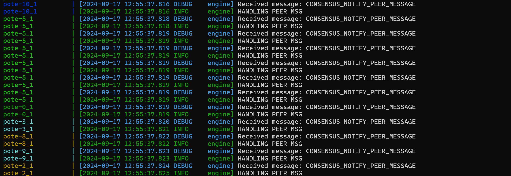
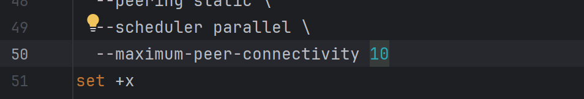
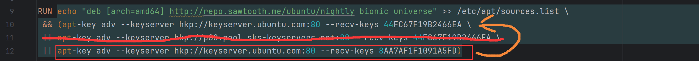

## 使用说明

### docker 部署
进入根目录后执行文件 `./init_docker.sh` 或者命令 `docker-compose build`

执行命令：`docker-compose up` 

注意的是，这个容器启动有点慢，可能要稍微等会让它们完全启动。  

显示以下信息的时候，表示还没连接成功，这时候提交交易有问题，请继续等会：
  

如果用pote共识，显示大量pote容器的消息时，则代表完全启动了：

### 执行交易
待所有容器完全启动后，先进入 `es-tp-x` 的容器中（x表示数字0-10）.  
然后执行命令：`python3 ./api.py` 即可提交交易。

`api.py` 文件用来和交易器进行交互，也就是提交交易之类的。如果要通过代码进行测速的话，可以在这文件中修改。具体查看该文件即可。

### 修改节点数量
首先 remove 容器的时候请使用`docker-compose down -v` 指令，将 volumes 数据清除。  

然后将 `docker-compose.yaml` 文件中的 **所有** 类型的容器数量都改为指定的数量。（如：rest-api, es-tp, pote, validator, setting-tp等等）.  

注：如果要修改最大节点数量，请先修改文件`./sawtooth_pote/scripts/main_validator.sh`中第 81 行的 `--maximum-peer-connectivity` 参数：

### 修改共识机制

#### 支持的共识机制
目前官方的示例一共有三种：devmode(这个不是正式的共识机制，官方用于测试的，共识也就是随机选举打包节点)、poet(基于流逝时间)、pbft(拜占庭容错)

poet 需要电脑硬件支持可信执行环境(TEE),比如 Intel 的 SGX 啥的。

在节点数量方面，devmode 节点数量随意。但 poet 最少需要3个，pbft 最少要4个节点才能正常运行（没试过）。

**上面说的节点数量是指 docker-compose.yaml 文件中的 validator 的数量**。

#### 替换方法

**_注：修改前请先执行命令`docker-compose down -v` 将 volumes 数据清除。_**

**_暂时存在问题，略。_**

[//]: # (##### 修改成 PoET)

[//]: # ()
[//]: # (目前问题在validator-0无法启动genesis block，无法加入其他节点，无法加载共识机制，问题未知。)

[//]: # ()
[//]: # (首先修改文件`./sawtooth_pote/scripts/main_validator.sh` 中 42 和 43 行的共识算法名和算法版本。算法名改为 `PoET`，)

[//]: # (版本改为 `0.1`.如图所示：)

[//]: # (![img.png]&#40;docs/img_7.png&#41;)

[//]: # ()
[//]: # (同时注释掉前 12 行代码：)

[//]: # (![img.png]&#40;docs/img_12.png&#41;)

[//]: # ()
[//]: # (并取消注释27 - 34 行：)

[//]: # (![img.png]&#40;docs/img_9.png&#41;)

[//]: # ()
[//]: # (然后需要将根目录的 docker-compose.yaml 中 10 - 18 行 poet-lead 容器部分给取消注释：  )

[//]: # (![img.png]&#40;docs/img_10.png&#41;)

[//]: # ()
[//]: # (并将 pote 部分换成 PoET 的共识机制引擎。 )

[//]: # (如图：)

[//]: # (pote:)

[//]: # (![img.png]&#40;docs/img_1.png&#41;)

[//]: # ()
[//]: # (poet：)

[//]: # (![img.png]&#40;docs/img_11.png&#41;)

### 部署时可能出现的问题

#### 报错：-bash: ./init_docker.sh: /bin/sh^M: bad interpreter: No such file or directory

这是因为编码问题，需要用dos2unix命令转换一下。  
没下dos2unix的话，执行命令: `apt install dos2unix`.  
然后执行命令：`dos2unix init_docker.sh`.  
以防万一你也可以将 `docker-compose.yaml` 和 `Dockerfile`也转换了.

#### 报错：GPG error: http://repo.sawtooth.me/ubuntu/nightly bionic InRelease: The following signatures couldn't be verified because the public key is not available: NO_PUBKEY 44FC67F19B2466EA 或者 

可能是网络问题，因为这个很不稳定，我部署的时候经常都要试很多次。。所以尝试多试几次。开梯子和关梯子都试几次。  

如果多次没用，可以将 Dockerfile 文件中的第12行内容放到第10行前面，或者把11行给删掉，然后执行`docker-compose build --no-chache`重试。
如图：

